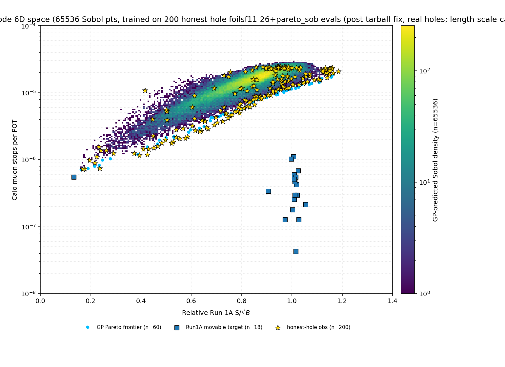
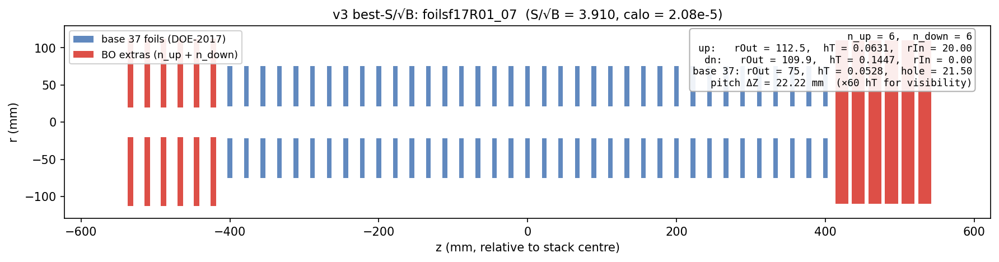
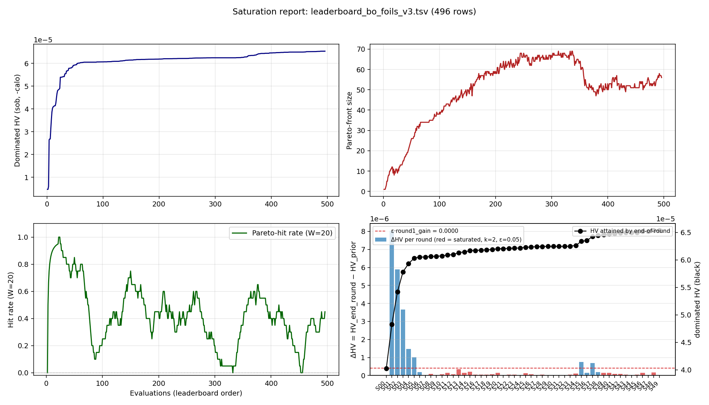
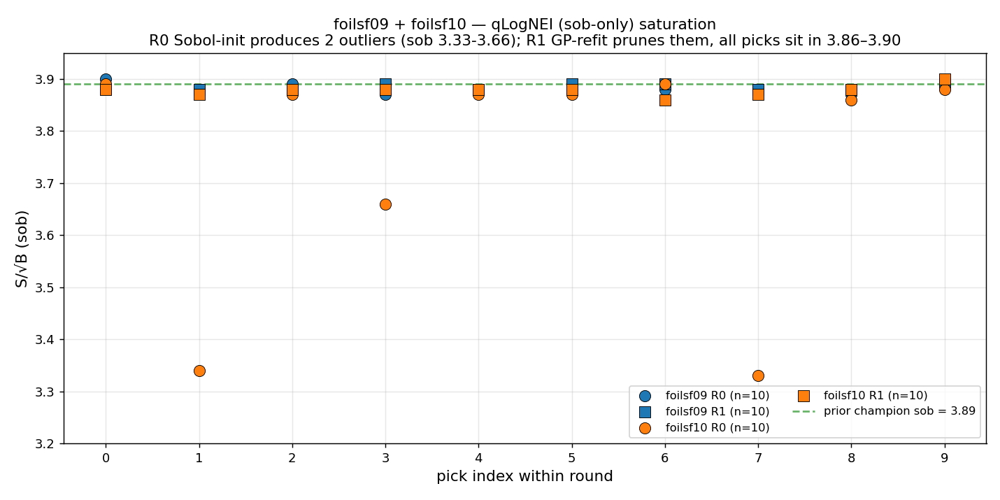
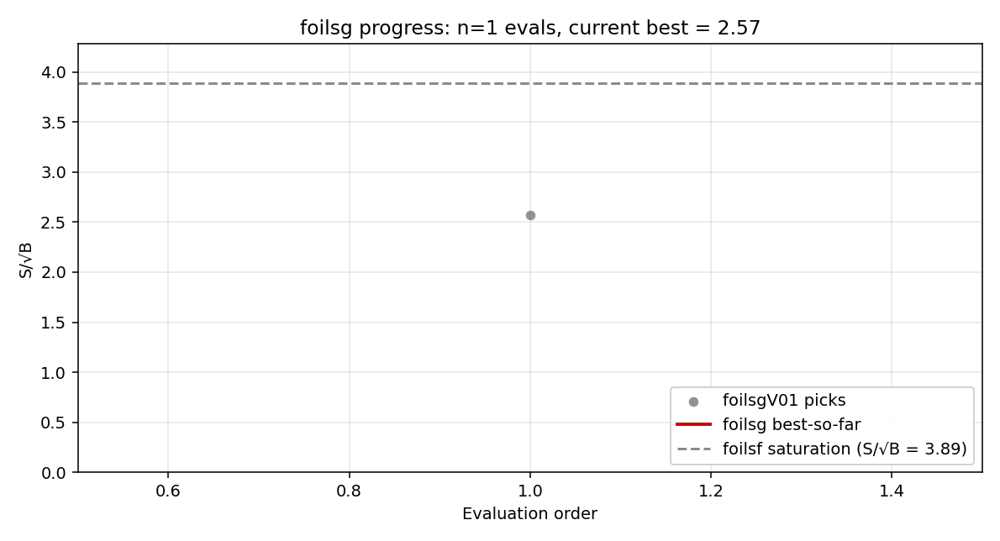

# Stopping-Target Foil Optimization
## v3 — fractional-hole geometry, Pareto-HV Bayesian Optimization (qLogNEHVI)

**Y. Oksuzian**
2026-06-13
Mu2e — autoresearch / closed-loop BO

> **Correction (2026-06-13).** All evals up to and including foilsf10 were
> built with a **uniform-hole grid-tarball fallback** (per-foil `holeRadii`
> vector not present in the worker Offline lib → scalar mean substituted),
> so the headline `sob ≈ 3.89` "champions" do NOT correspond to the picker's
> proposed per-foil hole pattern. The first **honest-hole** measurements are
> **foilsf11 (qNEHVI)** + **foilsf12 (qLogNEI)**, 40 evals total, with the
> patched `StoppingTargetMaker` in the worker tarball. Updated verdict: best
> honest sob = **3.85** (foilsf12R01_03, `f_up=0.156, f_dn=0`); large holes
> (`f ≥ 0.6`) cap at **sob ≈ 3.2**. See slide "Honest-hole verdict (foilsf11+12)".

---

## What we optimize

Add **extra foils** up/downstream of the pinned **37-foil** stopping-target base
(deployed spec: `rOut=75`, `halfThickness=0.053 mm`, `holeRadius=21.5` — fixed).

**6-D knob set** (**6 upstream + 6 downstream extras**, one shared triple per side):

| knob | range |
|---|---|
| `extra_rOut_up / dn` | 50 – 250 mm |
| `extra_halfThickness_up / dn` | 0.05 – 1.0 mm |
| `extra_f_up / dn`  — hole **fraction** `f = rIn/rOut` (`f<1` ⇒ always buildable) | 0 – 0.95 |

**Two competing goals:** **maximize** `S/√B` (Run1A CE significance) and
**minimize** `calo` (Run1B calo-stop background). We optimize the **trade-off
between them directly** — and report the achievable front.

---

## The optimizer: qLogNEHVI

Closed-loop BO: refit a GP on every eval, propose `q` candidates per round, run
them in parallel on the grid, repeat.

**Acquisition = qLogNEHVI** (log Noisy Expected Hypervolume Improvement):

- **Multi-objective** — maximizes the Pareto hypervolume of `(S/√B, −log calo)`;
  maps the whole `S/√B`–`calo` trade-off front in one run.
- **Noisy** — marginalizes the ~8% calo measurement noise (right for our
  stochastic G4 metrics).
- **Log-stabilized** — fixes the vanishing-gradient failure of plain qNEHVI, so
  the candidate optimizer keeps finding good points **even near saturation**.

---

## The 6-D Pareto landscape

GP density over the 6-D space, **200 honest-hole evals (foilsf11–26 + pareto_sob, post-tarball-fix)**; **gold = exploration picks**; **blue squares = Run1A movable target (degrader)**.

- Exploration maps the **whole front** in one campaign.
- The **off-axis big-hole corner** (far left, low `S/√B`): a thin ring at large
  `rOut` sits far off the beam axis and misses the muons — it's the ring's
  **absolute radius** that matters, not the fraction `f`.
- The frontier is **soft and broad** — no single sharp optimum.

---

## The result: best S/√B at a calo budget

Just *"how much signal if you cap the calo background at B?"* (**200 honest-hole evals**):

<table class="geom-tbl">
<tr><th>calo budget <code>B</code></th><th>best <code>S/√B</code></th><th>at calo</th><th>upstream extras (×6)</th><th>downstream extras (×6)</th></tr>
<tr>
  <td>≤ 1e-6 (clean detector)</td><td>0.78</td><td>7.4e-7</td>
  <td>
    <svg width="48" height="48" viewBox="-35 -35 70 70"><circle cx="0" cy="0" r="30" fill="#3355aa"/><circle cx="0" cy="0" r="9" fill="none" stroke="#cc0000" stroke-width="1.5" stroke-dasharray="2,2"/></svg>
    solid disc rOut=250 full thick 1.70 mm
  </td>
  <td>
    <svg width="48" height="48" viewBox="-35 -35 70 70"><path d="M30,0 A30,30 0 1,0 -30,0 A30,30 0 1,0 30,0 M6.1,0 A6.1,6.1 0 1,1 -6.1,0 A6.1,6.1 0 1,1 6.1,0" fill="#3355aa" fill-rule="evenodd"/><circle cx="0" cy="0" r="9" fill="none" stroke="#cc0000" stroke-width="1.5" stroke-dasharray="2,2"/></svg>
    ring rIn=50.6, rOut=250 full thick 1.36 mm
  </td>
</tr>
<tr>
  <td>≤ 1e-5 (<b>knee</b>)</td><td><b>3.06</b></td><td>9.9e-6</td>
  <td>
    <svg width="48" height="48" viewBox="-35 -35 70 70"><path d="M21.4,0 A21.4,21.4 0 1,0 -21.4,0 A21.4,21.4 0 1,0 21.4,0 M9.8,0 A9.8,9.8 0 1,1 -9.8,0 A9.8,9.8 0 1,1 9.8,0" fill="#3355aa" fill-rule="evenodd"/><circle cx="0" cy="0" r="9" fill="none" stroke="#cc0000" stroke-width="1.5" stroke-dasharray="2,2"/></svg>
    ring rIn=82, rOut=178 thick 0.48 mm
  </td>
  <td>
    <svg width="48" height="48" viewBox="-35 -35 70 70"><circle cx="0" cy="0" r="19.1" fill="#3355aa"/><circle cx="0" cy="0" r="9" fill="none" stroke="#cc0000" stroke-width="1.5" stroke-dasharray="2,2"/></svg>
    solid disc rOut=159 thick 0.66 mm
  </td>
</tr>
<tr>
  <td>unconstrained (max signal)</td><td><b>3.91</b></td><td>2.08e-5</td>
  <td>
    <svg width="48" height="48" viewBox="-35 -35 70 70"><path d="M13.5,0 A13.5,13.5 0 1,0 -13.5,0 A13.5,13.5 0 1,0 13.5,0 M2.4,0 A2.4,2.4 0 1,1 -2.4,0 A2.4,2.4 0 1,1 2.4,0" fill="#3355aa" fill-rule="evenodd"/><circle cx="0" cy="0" r="9" fill="none" stroke="#cc0000" stroke-width="1.5" stroke-dasharray="2,2"/></svg>
    ring rIn=20.0, rOut=112 thick 0.126 mm
  </td>
  <td>
    <svg width="48" height="48" viewBox="-35 -35 70 70"><circle cx="0" cy="0" r="13.2" fill="#3355aa"/><circle cx="0" cy="0" r="9" fill="none" stroke="#cc0000" stroke-width="1.5" stroke-dasharray="2,2"/></svg>
    solid disc rOut=110 thick 0.289 mm
  </td>
</tr>
</table>

<small>Sketches: end-on (along beam axis). Filled blue = extra-foil annulus. Dashed red circle = base-foil rOut=75 mm for scale.</small>

- **Roughly linear from 1e-6 to 2e-5**: ~78% of max signal at `calo ≤ 1e-5` (3.06 of 3.91). Below `1e-6` only ~20% remains (0.78 of 3.91).
- **The deliverable is the trade-off curve** — read off whatever calo budget the detector requires.

---

## Best-significance stack — side view

- **Upstream extras (red, left)**: 6 thin annuli, rIn=20.0 / rOut=112.5, thick 0.126 mm — degrade beam momentum just enough to stop more muons in the base.
- **Downstream extras (red, right)**: 6 **solid discs** (rIn=0) / rOut=109.9, thick 0.289 mm — full discs catch the unstopped beam and off-axis halo.
- **Base 37 (blue)**: deployed DOE-2017 stack, untouched (rOut=75 / hole=21.5 / thick 0.106 mm).
- Foil thickness ×60 for visibility (real hT << pitch ΔZ = 22.22 mm).

---

## Top 10 by S/√B

<table class="top3">
<tr>
  <th>rank</th><th>config</th><th>S/√B</th><th>calo</th>
  <th colspan="3">upstream (×6 extras)</th>
  <th colspan="3">downstream (×6 extras)</th>
</tr>
<tr>
  <th></th><th></th><th></th><th></th>
  <th>rOut</th><th>rIn</th><th>hT</th>
  <th>rOut</th><th>rIn</th><th>hT</th>
</tr>
<tr><td>1</td><td class="name">foilsf17R01_07</td><td><b>3.910</b></td><td>2.08e-5</td><td>112.5</td><td>20.0</td><td>0.063</td><td>109.9</td><td>0.0</td><td>0.145</td></tr>
<tr><td>2</td><td class="name">foilsfPS01R01_01</td><td>3.840</td><td>1.95e-5</td><td>120.9</td><td>30.5</td><td>0.062</td><td>118.2</td><td>36.2</td><td>0.146</td></tr>
<tr><td>3</td><td class="name">foilsf14R00_06</td><td>3.830</td><td>2.34e-5</td><td>55.1</td><td>8.3</td><td>0.084</td><td>104.8</td><td>8.8</td><td>0.155</td></tr>
<tr><td>4</td><td class="name">foilsfPS01R00_00</td><td>3.820</td><td>2.28e-5</td><td>118.0</td><td>23.5</td><td>0.025</td><td>111.9</td><td>29.6</td><td>0.151</td></tr>
<tr><td>5</td><td class="name">foilsfPS01R01_00</td><td>3.820</td><td>2.29e-5</td><td>66.7</td><td>10.4</td><td>0.100</td><td>111.0</td><td>22.2</td><td>0.125</td></tr>
<tr><td>6</td><td class="name">foilsf11R01_05</td><td>3.810</td><td>2.31e-5</td><td>50.0</td><td>0.0</td><td>0.095</td><td>109.9</td><td>0.0</td><td>0.186</td></tr>
<tr><td>7</td><td class="name">foilsfPS01R00_01</td><td>3.800</td><td>2.11e-5</td><td>90.9</td><td>12.0</td><td>0.101</td><td>137.9</td><td>22.6</td><td>0.138</td></tr>
<tr><td>8</td><td class="name">foilsfPS01R01_03</td><td>3.800</td><td>2.29e-5</td><td>118.0</td><td>2.5</td><td>0.014</td><td>100.8</td><td>17.9</td><td>0.128</td></tr>
<tr><td>9</td><td class="name">foilsfPS01R01_02</td><td>3.800</td><td>2.13e-5</td><td>90.6</td><td>6.2</td><td>0.092</td><td>126.6</td><td>45.6</td><td>0.105</td></tr>
<tr><td>10</td><td class="name">foilsfPS01R00_02</td><td>3.790</td><td>2.26e-5</td><td>66.4</td><td>14.4</td><td>0.063</td><td>108.4</td><td>18.8</td><td>0.088</td></tr>
</table>

<small>All dimensions mm. Base 37 foils unchanged: rOut=75, rIn=21.5, hT=0.053.</small>

- **The top of the front is geometrically diverse — NOT a single family**: upstream rOut spans 50–121 mm, hT 0.014–0.101 mm; some pair a small upstream hole with **solid downstream discs**, others are holed on both sides.
- S/√B within **~3%** (3.79–3.91) across the top 10 — the front is **flat at the top**; many distinct geometries are near-optimal (σ(sob)≈0.4%, so ranks 2–10 are statistically indistinguishable).
- Picked across **4 honest-hole campaigns** (foilsf11 / 14 / 17 + pareto_sob), the latter a sob-corner exploit — the flat top is real, no single geometry dominates.

---

## Convergence — front saturated

**VERDICT: SATURATED** — picker maps the front rather than climbing it (566 evals, ΔHV near zero for 10+ rounds).

---

## qLogNEI (sob-only) cross-check — foilsf09 + foilsf10

Two independent **single-objective qLogNEI** runs (40 evals, picker drops the DS-off
`run1b_mubeam` stage → ~40% faster). R0 Sobol-init produces a few low-rOut outliers
(sob 3.33–3.66); R1 GP-refit prunes them — all 20 R1 picks sit in **3.86–3.90**,
matching the 8-campaign cross-picker saturation at **sob ≈ 3.89**.

---

## Honest-hole verdict (foilsf11 + foilsf12)

After fixing the worker-tarball uniform-hole fallback
([[foilsg-grid-tarball-scalar-holeradius-fallback]]), 40 fresh evals on the
true per-foil geometry:

<table class="top3">
<tr><th>campaign</th><th>picker</th><th>evals</th><th>best honest sob</th><th>at (f_up, f_dn)</th><th>large-hole cap (f≥0.6)</th></tr>
<tr><td>foilsf11</td><td>qLogNEHVI</td><td>20</td><td><b>3.81</b></td><td>(0.00, 0.00)</td><td>3.08–3.27</td></tr>
<tr><td>foilsf12</td><td>qLogNEI</td><td>20</td><td><b>3.85</b></td><td>(0.156, 0.000)</td><td>3.15–3.38</td></tr>
</table>

**Both pickers, independently:**

- R0 Sobol sampled the full `f ∈ [0, 0.95]` range; large-hole picks plateau
  at **sob ≈ 3.2** (~15% below champion).
- R1 GP pivoted to **minimal/no holes**: best sob lands at
  `f_up ≈ 0–0.16, f_dn ≈ 0–0.22` with the same `rOut ≈ 90–115`,
  `hT ≈ 0.06–0.08 mm` family seen pre-fix.

**Take-away:** real-geometry holes do not help. The honest plateau is
**3.81–3.85**, just below the pre-fix 3.89 "champions" (which were inert
uniform discs, not the holey patterns the picker proposed).

---

## Status & next steps

- **Pre-fix campaigns (foilsZ02 … foilsf10, 346 rows):** uniform-hole fallback;
  relabeled `f = 21.5/rOut` in place — valid as a 1-D f-slice but the displayed
  `f_up`/`f_dn` columns no longer correspond to what was actually built.
- **Honest evals so far:** **40** (foilsf11 + foilsf12), 2 pickers, single
  geometry family confirmed; best sob = 3.85.
- **Open:** a third honest campaign (foilsf13) to tighten the 3.81–3.85 window
  was abandoned 2026-06-13 mid-launch due to launcher instability
  ([[closed-loop-parent-signal-kill-midlaunch]]); recommended retry under
  `tmux`/`systemd-run` on a pinned host with pre-warmed venv import.

---

## Next campaign: foilsg — free the base (12-D, 49 foils)

Drop the pinned 37-foil base. New stack: **49 foils** in 4 contiguous
z-groups of 12-13-12-12; each group shares one `(rOut, halfThickness, f)`
triple ⇒ **12 knobs total**.

| knob (×4 groups) | range |
|---|---|
| `rOut` — foil outer radius | 50 – 250 mm |
| `halfThickness` — foil half-thickness | 0.01 – 1.0 mm |
| `f` — hole **fraction** (`rIn = f · rOut`, `f<1` ⇒ always buildable) | 0 – 0.95 |

**Fixed**: z-extent 800 mm (matches deployed), `deltaZ = 800/48 ≈ 16.67 mm`.
Deployed 37-foil baseline is one point in this new space ⇒ any improvement
strictly dominates it.

**Picker = qLogNEI** (sob-only, no Run1B stage ⇒ ~40% wall-clock saving).

---

## foilsg progress

**All foilsg rows above (62 evals, foilsg01–foilsg06) were generated under
the same uniform-hole grid-tarball fallback and are TAINTED** — quarantined
to `leaderboard_bo_foilsg.broken.tsv`. Per-group hole fractions in those
rows are not what was actually built. **foilsgV01** (sob = 2.57 vs broken
3.16 for identical x) is the first grid-verified honest measurement.
A clean foilsg07+ campaign on the patched worker tarball is the real test
of whether free-base 49-foil geometry can clear the **honest 3.85 foilsf
plateau** (not the obsolete 3.89 number).

