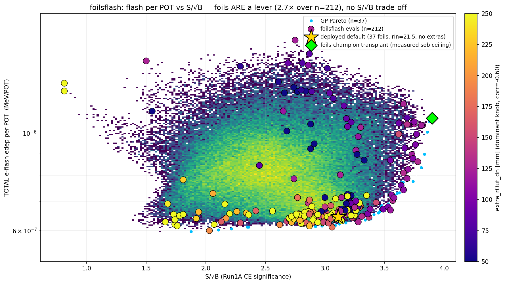
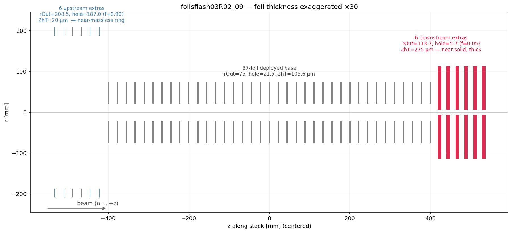

# Stopping-Target Foils vs Electron-Beam Flash
## Foils cut tracker electron-flash per POT ~2.7×

**Y. Oksuzian**
2026-07-07 · Mu2e — autoresearch / closed-loop BO

> **Result:** the extra stopping-target foils are a real lever on the electron-beam flash.
> Total flash energy per POT in the tracker varies **2.7×** across the explored geometry, at
> **no S/√B cost**. Eight **closed-loop BO campaigns** + a directed transplant (212 evals) map a
> clean **Pareto front** that **CONVERGES** on a floor-flash / high-S/√B corner **matching the
> deployed target**; the measured S/√B ceiling (**3.90**, foils-line champion) costs **+68% flash**.
> A central-hole A/B **reproduces Edmonds** (DocDB-10898), validating the flash pipeline end-to-end.

---

## What we optimize

**6-D extra-foil geometry** — ≤6 upstream + ≤6 downstream extra foils on the pinned 37-foil
base: `extra_rOut_up/dn` (50–250 mm), `extra_halfThickness_up/dn` (0.01–1.0 mm),
`extra_f_up/dn` = hole fraction `rIn/rOut` (0–0.95).

| objective | direction | source |
|---|---|---|
| `S/√B` | **maximize** | Run1A CE significance (`mustops_ce`, EdepAna) |
| total e⁻ EARLY-FLASH edep **per POT** in the tracker | **minimize** | `elebeam_flash` (EleBeamResampler, DS-on) |

**flash per POT** = `flash_edep_total / (N_input × POT-per-e⁻)`, normalized via `genCounter`
(EleBeamCat ≈ 11.5 POT/e⁻).

---

## The landscape

<small>212 evals (foilsflash02–09 + the foils-champion transplant, green ◆ at S/√B 3.90), colored by downstream radius `rOut_dn` (dominant knob); gold ★ = deployed default. GP Pareto front (cyan) traces the low-flash/high-S/√B edge; the dense cluster of evals AT the star = the optimizer converged on the deployed design.</small>

---

## Central-hole A/B — reproduces Edmonds

High-stats **matched** A/B: solid target vs **R = 21.5 mm** central hole (~40 M input e⁻ each):

| observable | solid | holed | hole effect |
|---|---|---|---|
| flash-event rate | — | — | **−24% (≈67σ)** |
| **total flash per POT** | 8.2e-7 | 6.4e-7 | **−21.5%** |

- Reproduces **Edmonds DocDB-10898** (central target hole cuts flash ~30%) — same direction,
  comparable magnitude; validates the pipeline end-to-end.
- Absolute scale ≈ **8×10⁻⁷ MeV/POT** in the straw gas (order-of-magnitude consistent with
  Edmonds once converted to wire charge).
- The **deployed** Run1 target already carries this hole (rIn = 21.5 mm, DOE-2017).

---

## The extra foils are a strong lever

- **best/worst ≈ 2.7×** in flash-per-POT across the 212 evals (GP fit R² ≈ 0.9).
- Knob physics (all strong, sensible):
  - more **upstream** material / radius → **more** flash (`rOut_up +0.37`, `hT_up +0.51`)
  - larger **downstream** radius + bigger holes → **less** flash (`rOut_dn −0.60`, `f_dn −0.50`)
- **corr(S/√B, flash-per-POT) = −0.13** → cut flash ~2.5× essentially **free** of signal.

The foils act as a scatterer of the on-axis electron beam — the same picture behind Edmonds'
central-hole result.

---

## Anatomy of the max-S/√B point

| design | rOut up/dn [mm] | 2·hT up/dn [µm] | hole rIn up/dn [mm] | S/√B | flash [MeV/POT] |
|---|---|---|---|---|---|
| `foilsflashSOBX01` — transplant | 112.5 / 109.9 | 126 / 289 | 20.0 / 0.0 | **3.90** | 1.08×10⁻⁶ |
| `foilsflash09R00_04` (self-found) | 136.3 / 115.9 | 20 / 327 | 1.9 / 10.3 | **3.82** | 1.04×10⁻⁶ |
| `foilsflash09R00_00` (self-found) | 89.3 / 121.7 | 20 / 327 | 13.3 / 0.0 | 3.81 | 1.04×10⁻⁶ |
| `foilsflash03R02_09` (sketch) | 208.5 / 113.7 | 20 / 275 | 187.0 / 5.7 | 3.77 | 9.93×10⁻⁷ |
| deployed default (no extras) | 75 / 75 | 106 / 106 | 21.5 / 21.5 | 3.11 | 6.45×10⁻⁷ |

<small>Two routes to high S/√B. The **sketch** (`foilsflash03R02_09`, 3.77): a 20 µm ring parked off-beam
(hole rIn 187 mm) + near-solid downstream. The **ceiling** (3.82–3.90): thin but **in-beam** upstream
(small holes, rIn 2–13 mm) degrading the beam to stop more muons — higher S/√B at higher flash
(~1.04–1.08×10⁻⁶). Once the transplant (row 1) seeded the GP, the optimizer **self-found** this corner
(rows 2–3, `foilsflash09`, up from a 7-campaign 3.77 plateau). Neither route sits at the flash floor —
S/√B is buyable with mass, never for free (champion 3.28 / 6.28×10⁻⁷).</small>

---

## Conclusion & next steps

- The stopping-target foils are a **usable electron-flash lever** — ≈2.7× swing in tracker
  flash-per-POT with **no S/√B trade-off** (a scatterer of the on-axis beam, same physics as Edmonds).
- **Eight closed-loop BO campaigns (211 evals) CONVERGED** on a floor-flash / high-S/√B corner
  (**S/√B ~3.2–3.4, flash ~6.3–6.4×10⁻⁷**) hit independently across every campaign — the best point
  (`foilsflash05R00_04`, 3.28 / 6.28e-7) only **ties** the deployed target within noise.
- **The S/√B ceiling is now measured, and priced**: the transplanted calo-line champion
  (`foilsflashSOBX01`) reproduces **3.90 vs 3.91 across two independent pipelines** at
  **flash 1.08×10⁻⁶ (+68%)**; the last +0.13 S/√B alone costs +9% flash — the optimizer's
  refusal of the in-beam upstream degrader was correct, not a blind spot. Once the transplant
  seeded the surrogate, the optimizer **self-reached S/√B 3.82** (`foilsflash09`, was stuck at 3.77).
- **Takeaway: the deployed 37-foil target is already near-optimal for electron flash** — the extras
  can hold the flash floor while trading S/√B, but there is no free lunch beyond today's design.
- The central-hole A/B **reproduces Edmonds**, confirming the flash pipeline is physically sound.
- **Next:** line is saturated → wind down; the method + validated pipeline transfer to the next knob.
