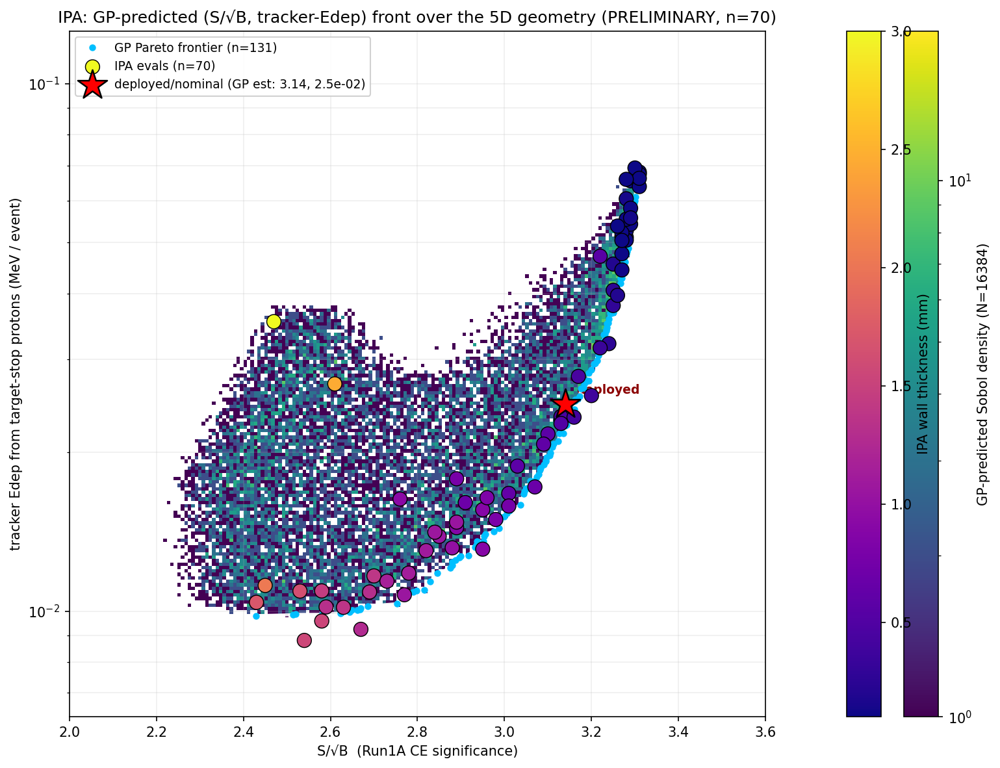
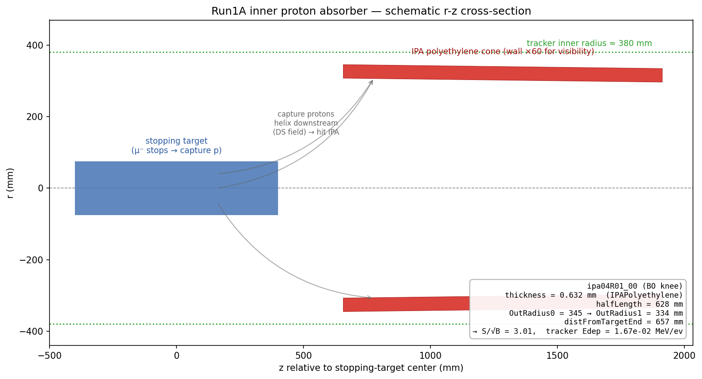

# Inner Proton Absorber Optimization
## 5D Bayesian Optimization — S/√B vs tracker energy deposition from capture protons

**Y. Oksuzian**
2026-06-22 · Mu2e — autoresearch / closed-loop BO

> **70 evals** (ipa04–11). The front is a still-sparse
> 5-D GP fit; trends are robust, exact contours will sharpen as rounds land.

---

## What we optimize

Vary the **Run1A inner proton absorber (IPA)** — the thin polyethylene cone
between the stopping target and the tracker — to shield the tracker from the
**protons emitted when μ⁻ capture on the Al target**, *without* spoiling the
105 MeV conversion-electron resolution.

**5-D knob set** (`protonAbsorber_cylindrical_v04.txt`):

| knob | range | deployed |
|---|---|---|
| `thickness` (wall) | 0.1 – 3.0 mm | 0.511 |
| `halfLength` | 200 – 700 mm | 500 |
| `OutRadius0 / OutRadius1` (cone taper) | 250 – 400 mm | 300.5 |
| `distFromTargetEnd` (z) | 400 – 800 mm | 625 |

**Two competing goals:** **maximize** `S/√B` (CE significance) and **minimize**
tracker **`StrawGasStep` Edep from target-stop protons** (occupancy/background).
We map the trade-off directly with qLogNEHVI.

---

## The S/√B – tracker-Edep front

GP density over the 5-D space; **points = real evals, colored by wall
thickness**; **red ★ = deployed/nominal config** (GP estimate: S/√B 3.14,
Edep 2.2e-2 — high on the front).

- **Thickness drives the trade-off:** thin → high `S/√B` but high tracker Edep
  (protons leak through); thick → absorbs protons but multiple-scatters the CE
  (lower `S/√B`).
- The front is **soft and broad** — many geometries are near-optimal.
- The other 4 knobs sit interior, modulating Edep at fixed thickness.

---

## Knee geometry — side view

<small>Capture protons from the target helix downstream in the DS field and strike the IPA cone before reaching the tracker. Wall thickness exaggerated ×60 for visibility (real ≈ 0.5–1 mm vs ≈ 340 mm radius).</small>

---

## Result: the deployed thickness is near-optimal

The (S/√B, tracker-Edep) Pareto corners:

| region | thickness | S/√B | tracker Edep (MeV/ev) |
|---|---|---|---|
| max signal (thin) | 0.19–0.26 mm | **3.25** | 4.1–4.6e-2 |
| **knee** | **0.63 mm** | **3.01** | **1.67e-2** |
| min background (thick) | 2.03 mm | 2.45 | **1.12e-2** |

- The **knee sits at thickness ≈ 0.6 mm — right next to the as-built 0.511 mm**:
  qLogNEHVI's exploit round converged there, so the **current Mu2e IPA thickness
  is already near-optimal** for the S/√B-vs-tracker-occupancy trade.
- The knee cuts tracker proton Edep **~2.4×** below the max-signal point for only
  **−0.24** in S/√B.

---

## Status & caveats

- **Validated end-to-end:** the IPA chain adds a `mustops_pileup` stage
  (`MuStopPileup.fcl`) that fires the capture-proton generators; harvest sums
  tracker `StrawGasStep` ionizing Edep (proton-dominated) per event.
- **Result so far:** thickness is the dominant Pareto axis; deployed ≈ optimal;
  full trade curve mapped around it.
- **70 evals** in 5-D → the GP cloud is still a modest fit; the
  corners are robust, the contours will tighten with more rounds (ipa05+).
- **Next:** more rounds to sharpen the knee; optional proton-only Edep filter
  (vs all capture products); the **outer proton absorber** is a CE-transparent
  lever worth a joint study.
