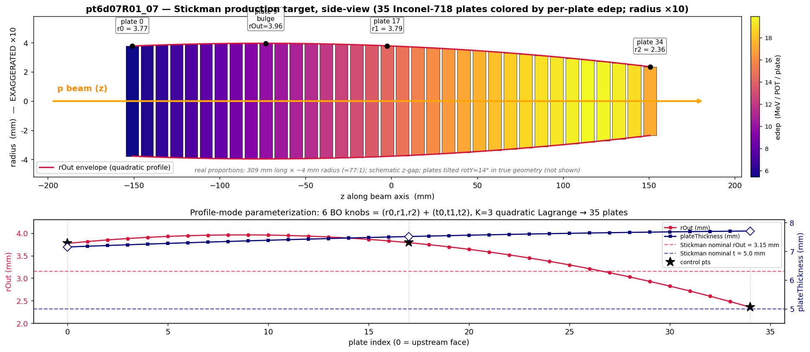
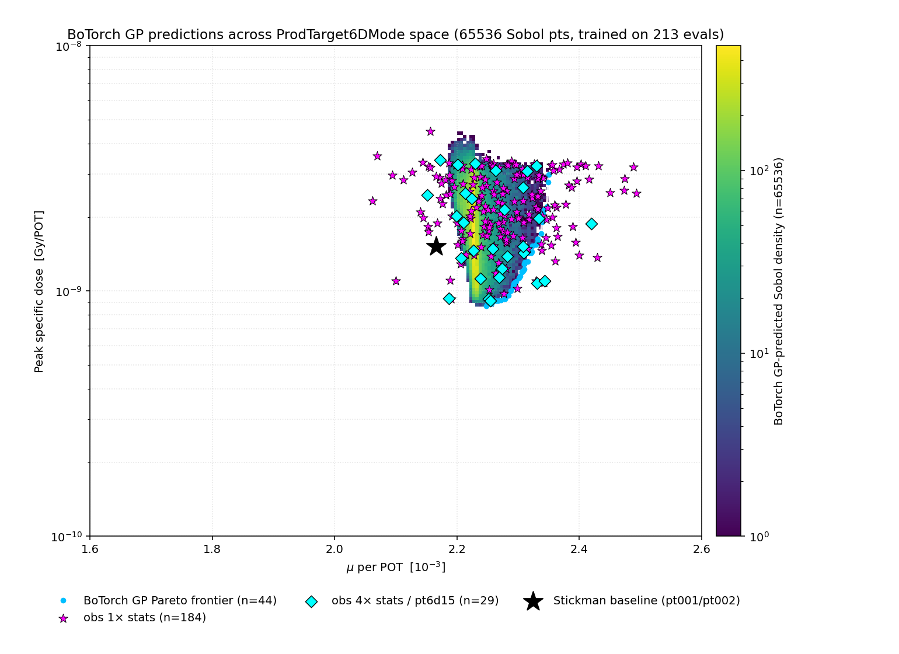
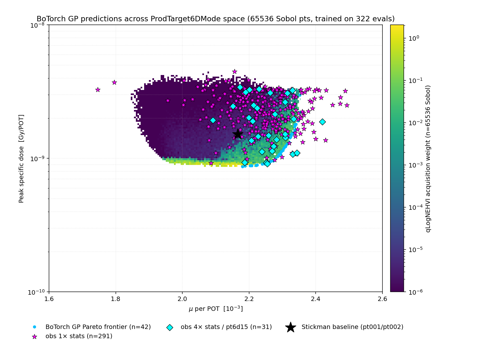

# Production Target Optimization — 6D Variant
## Reduced search space; profile-only Pareto BO

**Y. Oksuzian** — 2026-06-18
Mu2e — autoresearch / closed-loop BO

<small>**Status (2026-06-26):** pt6d01 → pt6d16 = **322 evals**, **8 strict Stickman dominators** (μ>2.169×10⁻³ AND peak_dose<1.527×10⁻⁹). **Best μ: `pt6d07R01_07`** at μ=**2.493×10⁻³** (+15.0%) / dose=2.51×10⁻⁹ — t=(7.15, 7.51, 7.71). **Best dose: `pt6d03R00_08`** at μ=2.193×10⁻³ (+1.2%) / **9.93×10⁻¹⁰** (−35%). **pt6d08 (2026-06-18):** picker GP refit on ONLY the t-upper=8 box (17→30 rows); 13 new box evals, best `pt6d08R01_08` μ=2.474×10⁻³ — **did not beat the champion** (−0.78%). 6/20 children died at the high-t `Spacer×Plate` overlap (30%). t-upper=8 regime **saturated**; next gain needs a different knob (rOut / N / material), not more t-headroom. **pt6d09 (2026-06-19):** full-history fit (control for pt6d08), q=10×2 — best `pt6d09R01_02` μ=2.488×10⁻³, **−0.22% under champion** (closest yet, still didn't beat it). Both follow-ups plateau under `pt6d07R01_07` → **robust μ ceiling** for the 6D box. **pt6d10 (2026-06-19):** throughput test — pot_only 100×5000→200×2500 (constant 500k events) cut the round **−35%** (~4.8h→~3.1h), now default; best 2.396×10⁻³, ceiling holds. **pt6d11–pt6d15 (2026-06-20→24):** five more q=10×4 full-history campaigns (322 evals total, 213 in the t-upper=8 box; pt6d15 ran 4× stats = 2M events/eval); pt6d11 best 2.378×10⁻³ (rough run, several R1 children died), pt6d12–pt6d15 completed, **pt6d16 q=10×4 in progress** — **champion ceiling `pt6d07R01_07` (2.493×10⁻³) still holds across all follow-ups.**</small>

---

## What we drop vs the 10D variant

| dropped knob | 10D range | 6D treatment |
|---|---|---|
| `N` — plate count | 25 – 45 (Integer) | **fixed at 35** (Stickman count) |
| `l0, l1, l2` — lug profile | 4 – 12 mm | **derived**: `lug = tPlate + 0.75 mm` |

What remains:

| knob (3 each) | range | units |
|---|---|---|
| `r0, r1, r2` — `rOut` profile | 2.0 – 4.5 | mm |
| `t0, t1, t2` — plate thickness | 3.0 – **8.0** | mm (raised 7→8 on 2026-06-15) |

**t-upper raised to 8.0** alongside an end-plate lug clamp (`lPlate[0]=lPlate[-1]=tPlate`) in `_expand`. The clamp eliminates the macro upstream/downstream lug-overhang that previously forced the 7.0 cap; lug-on-spacer geometry derives from `t` directly, so no free lug dimension is needed. See `prodtarget-spacer-supportring-overlap`.

---

## What the target looks like — champion geometry (`pt6d07R01_07`)

<small>**35 Inconel-718 plates**, ≈309 mm × ~4 mm radius (≈77:1); plates **colored by per-plate edep** (MeV/POT, peaks ~plate 30). The 6 BO knobs = **3 `rOut` + 3 thickness control points** (u={0,0.5,1}), expanded to 35 plates via K=3 Lagrange quadratic. Champion `rOut` bulges to **3.96 mm @plate 9**, tapers to **2.36 mm**; thickness **7.15→7.71 mm**.</small>

---

## Why a 6D track

The 10D campaign has produced 39 evals across pt001 → ptX05; best simultaneous Stickman-beat is **`ptX05R02_07`** at μ=2.31×10⁻³ / dose=1.39×10⁻⁹ Gy/POT. Open questions the 6D variant probes:

- **Does the lug profile matter for thermal performance?** If picks consistently come back with `l ≈ t + small offset`, the integer + 3 lug dims in the 10D variant are noise — 6D would converge faster per CPU-hour spent.
- **Does varying `N` add Pareto coverage, or just rediscover knee points?** 10D best sat at `N=35,36` (Stickman count anyway). Fixing N tests whether the integer-axis exploration was load-bearing.
- **Cleaner Pareto** — same `(μ, peak_dose)` objectives; reduced confounding from N+lug make the front easier to read on the slide deck.

---

## Optimizer & wiring (identical to 10D)

- **qLogNoisyExpectedHypervolumeImprovement** — multi-obj Pareto BO, log-stabilized near saturation.
- `q=10` per round, sequential-greedy via batched fantasies.
- **Cold-start fix** (2026-06-10): `botorch_predict._sobol_cold_start` draws Sobol points when history < 2. pt6d01 launched cleanly with empty leaderboard, no priors-projection.
- **Mode wiring** = MODE_SPECS entry + 6-knob `ProdTarget6DMode.build_space` + lug-derivation in `_expand`; reuses the entire pot_only / harvest / `peak_dose_Gy_per_POT` path.

`pt6d02` is warm-started on pt6d01's 10 Sobol rows; first true qNEHVI fit-and-pick happened at launch (R0).

---

## GP cloud — t-upper=8 regime only (pt6d07→pt6d16, n=213)

<table style="border-collapse: collapse; border: none; width: 100%;"><tr style="border: none;">
<td style="border: none; width: 65%; vertical-align: middle; padding: 0;">

</td>
<td style="border: none; width: 35%; vertical-align: middle; padding: 0 0 0 16px; font-size: 16px; text-align: left;">

65 536 Sobol-sampled posterior means, GP refit on **only the 213 t-upper=8 evals (pt6d07→pt6d16)** — the *current* search box, excluding the 109 older t≤7 runs. Black star = **Stickman baseline**; magenta ★ = 1× stats evals; **cyan ◆ = pt6d15 4×-stats (2M events/eval, ~1.5% Poisson — sit tighter to the GP surface)**.

- The landscape of the box we're actually searching now. μ of these evals **2.07 – 2.49×10⁻³**, all high-μ / high-dose.
- **Best μ `pt6d07R01_07`** μ=**2.493×10⁻³** / dose=2.51×10⁻⁹ at t=(7.15, 7.51, 7.71) — +15% over Stickman.
- **`pt6d08`:** refit the *picker* on these box rows only (was n=30 then) → 13 box evals, best `pt6d08R01_08` μ=**2.474×10⁻³** — concentrated where the champion lives but **did not beat it** (−0.78%). The box is saturated.
- ⚠️ **Sparse fit (n=213 in 6D):** the GP still rails near the corner — read the cloud loosely.
- Even on this regime-only fit the champion (2.493) sits just past the GP-mean edge (**2.350**). Restricting to the 213 box rows lifts the edge above the full n=322 fit, but the champion still sits beyond it — residual intrinsic GP-mean range compression, not old-data drag.

</td>
</tr></table>

---

## Acquisition heatmap — what the picker actually saw (Layer-1 fix)

<table style="border-collapse: collapse; border: none; width: 100%;"><tr style="border: none;">
<td style="border: none; width: 65%; vertical-align: middle; padding: 0;">

</td>
<td style="border: none; width: 35%; vertical-align: middle; padding: 0 0 0 16px; font-size: 16px; text-align: left;">

65 536 Sobol grid, **full n=322 GP fit** (all campaigns — not the t-upper=8-only fit of the previous slide), pixels colored by **qLogNEHVI acquisition value** instead of input-space density. Bright = where the picker sees Pareto-improvement; magenta stars = pt6d01 → pt6d16 evals.

**Why the previous cloud looked "sparse at picks":**

- The density cloud is the **pushforward of Lebesgue measure on the input box through the GP posterior MEAN** — it shows where a uniform-Sobol input lands, not where the picker wants to go.
- **Dominant cause (n=322 fit): GP posterior-mean range compression.** Predicted μ spans [1.85, 2.35]e-3, strictly inside the observed [1.75, 2.49]e-3. Standardize + Matern smoothing reverts extremes toward the bulk, so the best star (`pt6d07R01_07`, μ=2.493e-3) sits right of the cloud edge **by construction** — re-coloring the same grid cannot move it.
- qNEHVI optimizes Expected HVI on the GP belief; its front-edge / box-corner lobes are anti-correlated with input-space volume. Empirical check (n=112): σ_μ at picks = **0.40× the bulk**, σ_logdose **0.093×** — picks are at *lower* σ, not higher. The "sparse cloud = high-σ exploration" intuition is **refuted**.
- `pt6d07R01_07` (μ=2.493e-3) is only a **modest** forward-LOO surprise (~2–3σ, noise-convention dependent), ranking ~3rd–4th — **not** the largest; pt6d05R01_05 is the top mu-axis outlier. The earlier "+3.2σ, only surprise" claim was stale (n=105). Its +4% lead over #2 is just ~1.2 measurement-σ — statistically unresolved at 500k POT.

This panel shows what the picker is actually optimizing; the previous panel shows what the input space happens to map. Documented in [[gp-cloud-rendering]].

</td>
</tr></table>

---

## Status & next steps

**Now (322 evals):** pt6d01 → pt6d16 (10 Sobol cold-start + 312 qNEHVI). **8 strict Stickman dominators**; best-μ `pt6d07R01_07` at μ=**2.493×10⁻³** (+15.0%); best-dose `pt6d03R00_08` (−35% dose) unchanged. **μ ceiling broken** by raising t-upper 7→8, then **confirmed saturated** by pt6d08.

**pt6d08 verdict (2026-06-18):** to test whether the full-history GP was hiding a better high-t point, the picker GP was refit on **only the 30 t-upper=8 box rows** (env-gated `AUTORESEARCH_CURRENT_BOX_ONLY`, `botorch_predict.py`). 2 rounds, q=10: 14/20 children survived preflight (6 died at the high-t `Spacer×Plate` overlap = 30%), best `pt6d08R01_08` μ=**2.474×10⁻³** — **−0.78% under the champion**. The restricted fit concentrated proposals exactly where the champion lives but could not exceed it → **genuine saturation of the t-upper=8 regime**, not a full-history range-compression artifact.

**pt6d07 verdict (2026-06-17):** end-plate lug clamp + t-upper bump shipped together (`bo_driver.py:1527-1534` + `botorch_predict.py:108`). R0 = 10/10 clean even with picks pushing into the new headroom — the clamp removed the macro overhang the prior subagent had (incorrectly) predicted would cause 3–5 fails. R1 = 7/10: 3 children hit the residual `SpacerNegZ_0 × Plate00` overlap at **50–100 nm** (precision-tolerance class, same magic-offset signature as the documented `SpacerPosZ × Plate_last`). The prior "fourth-mode ~250–500 µm physical overhang" diagnosis is **retracted** ([[prodtarget-spacer-supportring-overlap]] updated).

**Key answer to the 2.39e-3 plateau question:** it was the box edge, not physics. qNEHVI used the new headroom on 11/17 picks (t1 ≥ 7.5); μ-axis kept climbing. But: every pt6d07 pick lands at dose ≥ 2×10⁻⁹, so the Pareto front extended **up-right** not up-left — strict-dominator count flat at 8. Raising t-upper buys μ at the cost of dose; doesn't unlock the dose-floor corner.

**Real next bottleneck:** dose-axis floor. The 8 strict dominators all cluster around dose ≈ 1.0–1.5×10⁻⁹; pushing below that requires a *different* knob (rOut profile, N, plate material) — not more t-cap headroom.

**Deferred:**
- **NegZ-spacer source patch** (mirror `spacerHalfLength -= stickmanMagicOffset` at `constructTargetPS.cc:1730`). Recovers the **~30% of high-t-corner picks** lost to this overlap per round (6/20 in pt6d08) and unblocks the upstream-spacer boundary cleanly. Source patch + muse rebuild + grid tarball rebuild. **Now the top lever** for any further t-upper=8 exploration — but the box is saturated, so weigh against pivoting to rOut/N/material first.
- **Path B NIEL** as 3rd objective — neutron channel still missing.
- `plateMaterial` categorical — needs mixed-model picker.
- `decide_next` hardening — should consult live `jobsub_q` before declaring "all failed → exit early".
