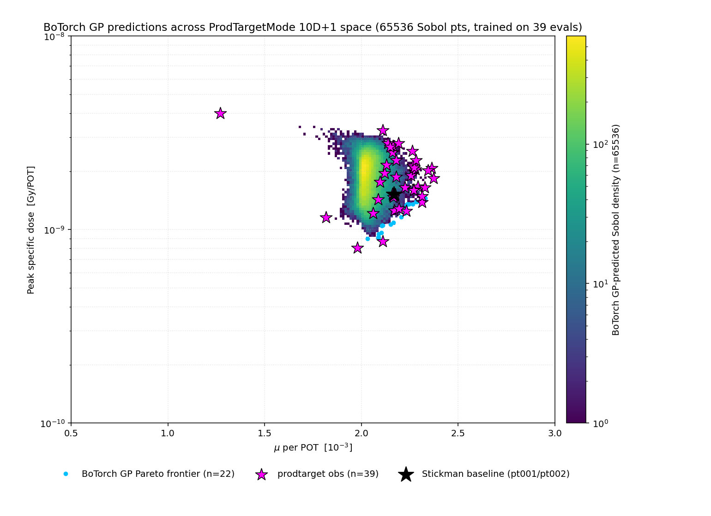

# Production Target Optimization
## Pareto BO over the Stickman PS target — methodology

**Y. Oksuzian** — 2026-06-11
Mu2e — autoresearch / closed-loop BO

<small>**Status (2026-06-12):** 39 evals on disk (pt001, pt002, ptX01, ptX02, ptX05). **5 Stickman-dominators** so far; best simultaneous beat is `ptX05R02_07` at μ=2.313×10⁻³ (+6.8%), dose=1.387×10⁻⁹ Gy/POT (−8.7%). Best μ-only `ptX05R02_04` 2.373×10⁻³ (+9.6%); best dose-only `ptX01R00_00` 8.03×10⁻¹⁰ Gy/POT (−47%). Parallel 6D variant (`prodtarget6d_talk`) has 50 evals + 6 dominators; 6D best-dose `pt6d03R00_08` at 9.93×10⁻¹⁰ now occupies the sub-1e-9 Pareto knee while still beating Stickman μ.</small>

---

## What we optimize

Baseline: **MDC2025aq Stickman v1.0** — 35 Inconel-718 plates,
`rOut=3.15 mm`, `t=5 mm`, rotated 14° about Y, in the PS vacuum.

**10-D + 1 integer search space** — three knots of a **quadratic profile**
along the stack for `rOut`, `plateThickness`, `plateLugThickness`, plus
plate count:

| knob (3 each: upstream / mid / downstream) | range | units |
|---|---|---|
| `r0, r1, r2` — `rOut` profile | 2.0 – 4.5 | mm |
| `t0, t1, t2` — plate thickness | 3.0 – 8.0 | mm |
| `l0, l1, l2` — plate lug thickness | 4.0 – 12.0 | mm |
| `N` — number of plates (Integer) | 25 – 45 | — |

Smooth, buildable, spans the full envelope around Stickman (`r=3.15, t=5, l=8`).

---

## Two competing objectives

- **Maximize** `mu_per_POT` — stopped muons per proton on target.
- **Minimize** `peak_dose_Gy_per_POT` = `max_i (Edep_i / mass_i)` over the 35 plates, with
  `mass_i = π · rOut_i² · t_i · ρ`, `ρ_{Inconel718} = 8.19 g/cm³`.
  Per-plate Edep via a custom `StepPointMC` collection per `ProductionTargetPlate%02d` volume.

**Sanity:** 1.5e-9 Gy/POT × 6×10¹⁵ POT/yr ≈ **9 MGy/yr** — same order as Stickman published design point.

**Noise floor:** `pt001` vs `pt002` (replicas) agree to **<0.5%** on peak dose.

---

## Why peak specific dose, not stack-total Edep

Stack-total `Edep` mis-ranks the thermally stressed designs three ways:

1. **1/rOut² coupling is invisible** — shrinking rOut keeps Edep roughly
   constant but divides by a smaller mass, so peak dose explodes.
2. **Hot-plate masking** — one plate at melt + 34 cool ≈ uniform stack
   on the total. Operationally fatal, statistically silent.
3. **N-scaling artifact** — more plates = more total, even when each
   plate sees less dose.

**Empirical confirmation** (from our 4 evals):

| config | stack Edep [MeV/POT] | **peak [Gy/POT]** | rank by Edep | rank by peak |
|---|---|---|---|---|
| `pt001` (baseline) | 422 | 1.53e-9 | 1 | 2 |
| `ptX01R00_00` | 412 | **8.0e-10 (best)** | 2 | **1** |
| `ptX01R00_01` | **179 (lowest!)** | **4.0e-9 (worst, 2.6× base)** | **4 (looks safest)** | **4** |

Lowest-Edep row = **highest-dose** row. Pareto BO on stack-total chases
the corner; peak dose corrects it.

---

## The optimizer: qLogNEHVI

Same picker stack as the foils campaign — proven on `(S/√B, −log calo)`,
transplanted onto `(mu_per_POT, −log₁₀ peak_dose)`.

- **Multi-objective** — maximizes Pareto hypervolume; delivers the *whole* dose-vs-yield front in one campaign.
- **Noisy** — marginalizes G4 per-POT Poisson noise (~0.5% on peak dose).
- **Log-stabilized** — fixes vanishing-gradient failure of plain qNEHVI near saturation.

`q=4` per round, sequential-greedy via batched fantasies (joint mode blew past 10-min wall at q=10 on foils).

**Closed-loop architecture is shared** — `prodtarget` is one entry in `MODE_SPECS` + one Y-column branch in `botorch_predict._load_history_tensor`; no per-mode picker code.

---

## GP cloud — current 10-eval landscape

<table style="border-collapse: collapse; border: none; width: 100%;"><tr style="border: none;">
<td style="border: none; width: 65%; vertical-align: middle; padding: 0;">

</td>
<td style="border: none; width: 35%; vertical-align: middle; padding: 0 0 0 16px; font-size: 16px; text-align: left;">

65 536 Sobol-sampled posterior means; GP trained on **n=10**.

- **Champion `ptX02R00_00`** sits up-and-left of Stickman: +3% μ, −18% dose.
- Predicted μ ceiling now reaches **2.14×10⁻³** (up from 1.99 at n=4); GP has learned the upper envelope.
- Picker recently explored a high-dose ridge (`R01_02` at 3.3×10⁻⁹) — qLogNEHVI buying hypervolume, not just chasing the knee.

</td>
</tr></table>

---

## Status & next steps

**Now (39 evals):** 4 baseline-era rows + ptX01 (2) + ptX02 (7) + ptX05 (28, q=10 × 3 rounds, qNEHVI). 5 Stickman-dominators identified, biggest simultaneous beat `ptX05R02_07` at μ=2.313e-3 / dose=1.387e-9.

**Pareto leaders (peak dose ↑):** `ptX01R00_00` (8.0e-10 / 1.98e-3) → `ptX05R00_04` (8.7e-10 / 2.11) → `ptX02R00_03` (1.16e-9 / 1.82) → `ptX05R00_05` (1.28e-9 / 2.19) → **`ptX05R02_07` (1.39e-9 / 2.31)** → `ptX05R02_04` (1.84e-9 / 2.37 — best μ).

**Next:** parallel 6D variant under separate deck (`prodtarget6d_talk`); 10D campaign next move TBD (likely ptX06 to push further into the dose-favorable corner around `ptX05R00_04` at 8.7×10⁻¹⁰ / 2.11×10⁻³).

**Deferred:**
- **Path B NIEL** as 3rd objective — custom SD still missing neutron channel; ICRU49-only underestimates DPA ~10× vs published Stickman 10 DPA/yr.
- `plateMaterial` categorical (Inconel/W/Ta) — needs mixed-model (qParEGO / one-hot) rather than continuous qNEHVI.
- Closed-loop final-round orphan-on-exit bug — ptX02R01_03 lost when parent exited clean at max_rounds; manual harvest TBD.
